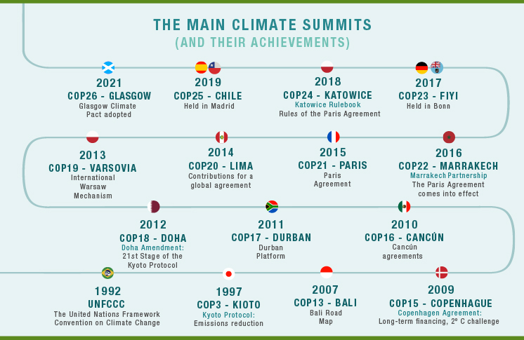
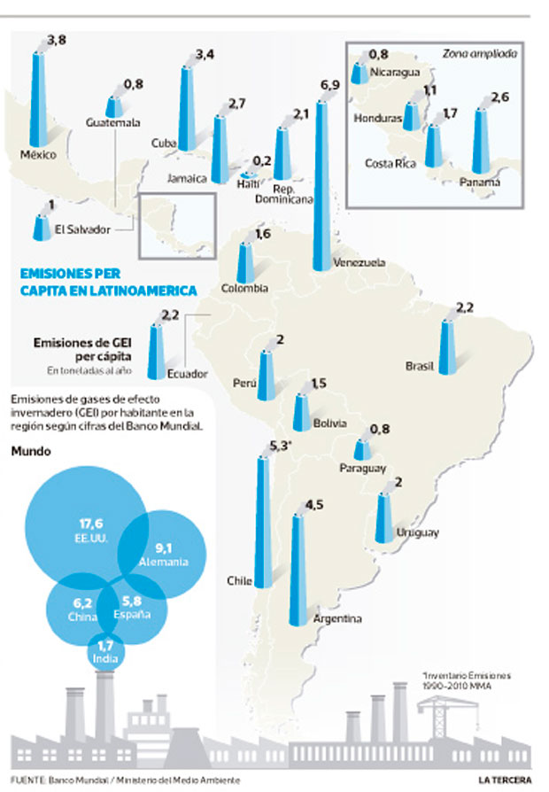
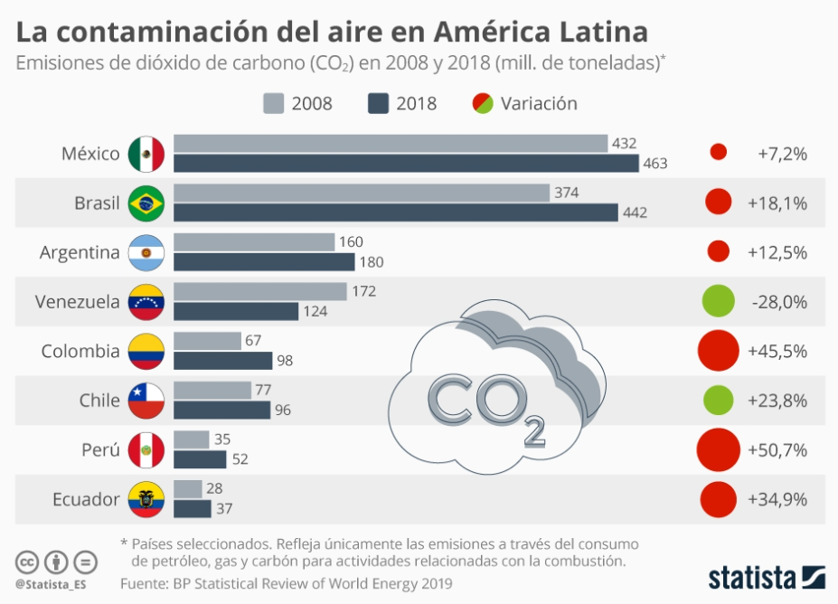

### Introducción

La sociedad contemporeana enfrenta un desafio importante que podria determinar como nuestro futuro se vera, el cambio climatico antropogenico. El cambio climatico esta definido como el cambio en largo plazo de temperaturas y los patrones climaticos (UN, 2021). El cambio climatico antropogenico es negativo porque puede cambiar el ecosistema a uno con recursos escarcos, biodiversidad reducida, probalidad incrementada de hazards naturales, y mas. Todos estas fenomenas haran el vivir en este planeta como lo conocemos mas dificil. El cambio climatico antropogenico tendra consecuencias sociales de gran magnitud. 

El cambio climatico es mayormente causado por las emisiones de gases (o emisiones) que retienen el calor solar en nuestro planeta. Estas emisiones de gases son mayormente consecuencia directa del uso de recursos de combustibles fósiles, i.e., recursos esenciales para la economia contemporanea.

Para contrarestar este cambio climatico antropogenico, diferentes gobiernos alrededor del mundo han firmado varios acuerdos desde 1992 para mitigar el cambio climatico. El acuerdo mas importante hasta ahorita ha sido el **Paris Agreement (2015)** al cual se unieron no mas que '**193 paises**'! El proposito es tener una meta para la regulacion local de emisiones. 



Tambien en Chile (y Latino America) la situacion de emisiones es critica. En Santiago es evidente con la cantidad de smog que hay atrasa severamente la salud ambiental y de las personas, posiblemente con consecuencias a largo plazo. En la imagen podemos ver que Chile en el 2014 queda en segundo lugar como emitor de gases de invernadero per capita. 



Cuando vemos el tiempo transcurrir entre 2008 y 2018 vemos que las emisiones han subido con un 23.8 \%. Esto plantea la pregunta politica:
### *Ha tenido efecto la politica chilena a la polucion causada por gases de invierno?* 


Para cualitativamente contestar esta pregunta hay que entender que politicas ambientales el gobierno Chileno ha introducido desde 1990 (fin de la democracia). Estas se pueden sumarizar a base de las metas y politicas propuestas. Es importante notar que hay una distincion entre la politica y su efecto. Por esta misma razon, se vuelve interesante evaluar el efecto agregado de la politica a las emisiones. Asi que, que las siguientes politicas han sido introducidas:

* Falta informacion de primero que esto....
* 2017: Implementacion impuestos verdes de US$5 por tonelada CO2 eq.
* 2018: Plan de Adaptación del Sector Energía
* 2017-2022:Plan de Acción Nacional de Cambio Climático 2017-2022
* 2019: El Gobierno se comprometió en 2019 cerrar todas las centrales de Carbón en Chile al 2040. En 2019 cerraron 4. En 2021 cerraron 4 mas. En total hay 28. (Energia, 2021)
* 2019: Relac **en todo Latino America**; el 70% de la generación eléctrica en esta parte del mundo sea generada con fuentes de energía renovable para el año 2030. Para Chile seria un **maximo** de 95 millones de toneladas de gases de efecto invernadero para 2030.

### Tema de enfoque

Dependiendo de la base de datos disponibles puedo determinar cual mi enfoque sera. El enfoque principal es en 'datos politicos'. En este se interpreta:
* **Politica y polucion: Enfocarse en la dinamica a traves del tiempo entre cambios politicos y la polucion en diferentes partes del ecosistema (agua, aire).**

# Variables operacionales

* 1. Emisiones en CO2 equivalentes
* 2. Porcentage de Urbanizacion
* 3. Porcentage de Agricultura 
* 4. Consumo energetico
* 5. Generacion energetica (no-renovable, o renovable)
* 6. Estatus socio-economico de la poblacion
* 7. Acuerdos internacionales/ Cumbres
* 8. Cambio de partido politico
* 9. Gobernancia de legislicacion
* 10. Cambios electorales
* 11. Inclinacion democratica del gobierno

Para esto he encontrado varios bases de datos:

* [Registro de Emisiones y Transferencias de Contaminantes (RETC)](https://datosretc.mma.gob.cl/organization/retc) 
* [World Bank Data para Chile](https://data.worldbank.org/country/chile) 
* [OCHA UN de Chile para indicadores ecologicos](https://data.humdata.org/dataset/world-bank-environment-indicators-for-chile/resource/2c62322f-3ab9-4a22-af03-f67df894a709)
* [Emisiones de Chile segun el Banco Mundial Chile](https://datos.bancomundial.org/indicador/en.atm.co2e.pc?locations=CL)


### Hipotesis

Mi *hipotesis* es la siguiente: **Las emisiones tienen una relacion debil con el cambio de politica**

Subhipotesis:
a) *Dependiendo de la industria el efecto de la politica es mas fuerte o menos fuerte.*


Argumentos:

Viendo que las emisiones siguien subiendo en Chile, es la pregunta si estas politicas han tenido efecto.

### Referencias

* [UN, 2021; What is climate change](https://www.un.org/es/climatechange/what-is-climate-change) 
* [CR2, 2014; Emisiones latino america per capita](https://www.cr2.cl/chile-el-segundo-pais-que-mas-emisiones-per-capita-genera-en-latinoamerica/) 
* [Statista, 2019; Emisiones de paises Latino Americanos](https://es.statista.com/grafico/20195/emisiones-de-co2-en-paises-latinoamericanos-seleccionados/)
* [Gobierno de Chile, 2021; Cierre de Centrales de carbon](https://energia.gob.cl/noticias/los-lagos/ministerio-de-energia-anuncia-historico-cierre-adelantado-de-centrales-carbon)


```{r setup, include=FALSE}
knitr::opts_chunk$set(echo = FALSE)
```

Distill is a publication format for scientific and technical writing, native to the web.


