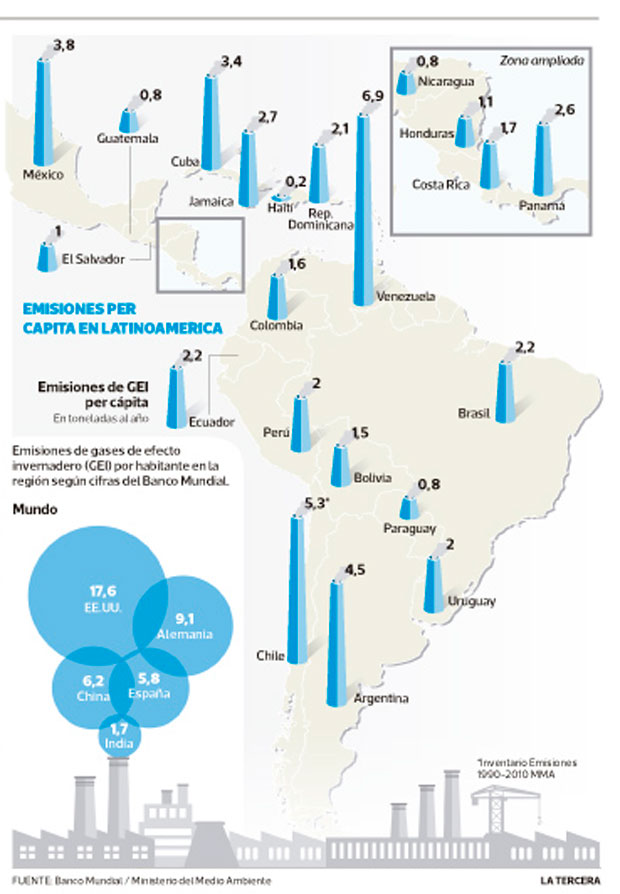
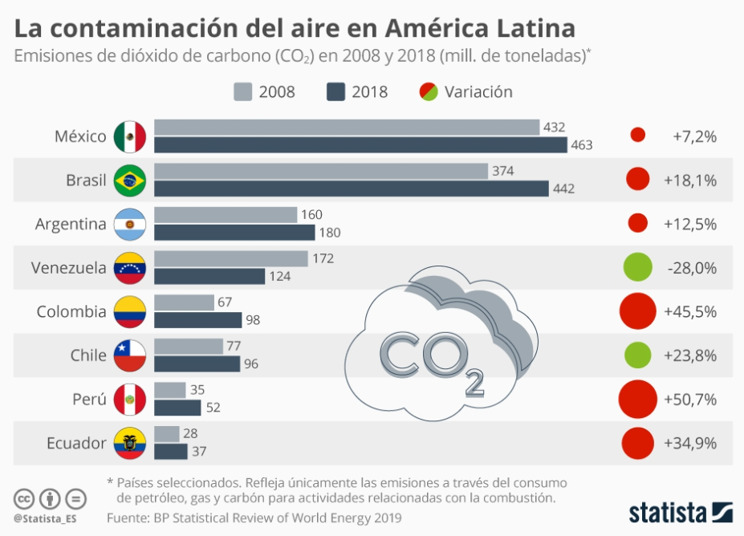

# Resúmen investigación previa

Tambien en Chile (y Latino America) la situacion de emisiones es critica. En Santiago es evidente con la cantidad de smog que hay atrasa severamente la salud ambiental y de las personas, posiblemente con consecuencias a largo plazo. En la imagen podemos ver que Chile en el 2014 queda en segundo lugar como emitor de gases de invernadero per capita. 



Cuando vemos el tiempo transcurrir entre 2008 y 2018 vemos que las emisiones han subido con un 23.8 \%. Esto plantea la pregunta politica:
### *Ha tenido efecto la politica chilena a la polucion causada por gases de invierno?* 



## Entendiendo el contexto cualitativo

### Buscando politicas públicas

* 2017: Implementacion impuestos verdes de US$5 por tonelada CO2 eq.
* 2018: Plan de Adaptación del Sector Energía
* 2017-2022:Plan de Acción Nacional de Cambio Climático 2017-2022
* 2019: El Gobierno se comprometió en 2019 cerrar todas las centrales de Carbón en Chile al 2040. En 2019 cerraron 4. En 2021 cerraron 4 mas. En total hay 28. (Energia, 2021)
* 2019: Relac **en todo Latino America**; el 70% de la generación eléctrica en esta parte del mundo sea generada con fuentes de energía renovable para el año 2030. Para Chile seria un **maximo** de 95 millones de toneladas de gases de efecto invernadero para 2030.

Tras analizar el contexto mejor descubri que el proceso para convertir estas politicas en variables operacionales requiere usar de la metodologia, Natural Language Processing. La desventaja de este metodo es que es complicado y requiere un gran montante de datos para que funcione correctamente. Al buscar documentos gobernamentales, se descubre que se discuten mucho los objetivos de regulaciones sin definir la regulacion concretamente. Los objetivos son repetidos. Las regulaciones se definen regionalmente. **Politicas que aplican en la región metropolitana no siempre aplican en otro lugar de Chile.** Es decir, minimizar el scope de la investigacion a base de industria o comuna, requiere mas datos. Mantener el *high-level scope* de la investigacion actual, requiere entender cuales inferencias se pueden hacer. Las dos opciones tienen un alto nivel de complexidad por la falta de datos o la interconexion de inferencias causales. Es por esta razón que se ha tenido que iterar en la investigacion.

## Una formulacion nueva: percepcion publica de la importancia del medio ambiente

Para mantener el foco del medio ambiente y su polucion, se decidio combinar esto con percepciones publicas a traves de la **[Encuesta Nacional del Medio Ambiente](https://mma.gob.cl/encuestas-nacionales-del-medio-ambiente/) producido por el Ministerio del Medio Ambiente**. A su vez, esta base de datos se va a combinar con **[Registro Historico de Estadisticas Ambientales en Chile](https://stat.ine.cl/Index.aspx?DataSetCode=E10000001) producido por el Instituto Nacional de Estadisticas.**

### Buscando cambios climaticos

* El 2019 es el noveno año consecutivo con temperaturas sobre el promedio en Chile.
* El 2019 tuvo un déficit promedio de 23% y es el segundo año más seco desde 1981.Las localidades con mayores déficits de precipitaciones se encuentran entre las regiones de Coquimbo hasta Biobío, con un promedio de -70%.
* En el periodo 2010-2019 se registraron 64 eventos de olas de calor. El 2019 hubo un récord de 13 olas de calor en Santiago.
* Aunque no toda la erosión se produce por el cambio climático, playas como Hornitos (Antofagasta) o Algarrobo (Valparaíso) muestran u retroceso de más de 2 metros promedio al año.

### Hipotesis

Mi *hipotesis* es la siguiente: **La percepcion publica cambia a traves de los anos por discursos ambientales politicos importantes y cambios en el clima que se pueden experenciar.** Esta investigacion intentara encontrar tambien la relacion a escala modular entre la percepcion a base de indicadores socio-demograficos y socio-economicos.

## Variables operacionales

Primero, cargaremos los paquetes que utilizaremos en esta sesión:

```{r paquetes, warning=FALSE, message=FALSE}
library(tidyverse)
library(sjmisc)
library(haven)
library(kableExtra)
library(readxl)
library(skimr)
```

Y cargaremos la base de datos con variables ya seleccionadas:

```{r}
df_2014 <- read_sav("data/Base_en_SAV_Primera_Encuesta_Nacional_de_Medio_Ambiente_2014.sav")
df_2015 <- read_sav("data/Base_en_SAV_Encuesta_Medio_Ambiente_2015.sav")
df_2016 <- read_sav("data/Base_en_SAV_Encuesta_de_Medio_Ambiente_2016.sav")
df_2018 <- read_excel("data/Base-en-excel-Encuesta-Nacional-de-Medio-Ambiente-2018.xlsx")

######coming soon
```

Para ver cuales son los anos que tiene los mismos datos podemos ver el siguiente Excel: 

```{r echo = F}

#readxl::read_excel("input/220809 - Tablas.xlsx") %>% 
  #knitr::kable(., align = '') %>% 
  #kable_styling(bootstrap_options = c("striped"), html_font = 'Roboto Condensed') %>% 
  #column_spec(1, width_min = "6cm", bold = T) %>% 
  #column_spec(2, width_min = "3cm", border_left = T) %>% 
 # column_spec(3:10, width_min = "2cm", border_left = T) %>% 
#  scroll_box(width = "100%", height = "400px")
```


```{r}
skimr::skim(df_2014)
```
Primero voy a limpiar mis datos. Decido remover cualqueir columna que se acerque a una falta de 30% de los datos totales, eso serian.Es un porcentaje alto, pero hay muchos datos faltantes asi que para no perder demasiado datos, se mantiene toda variable con >30% datos hasta que se encuentre un metodo para estimarlos. Si no se puede, seran removidos.

En este contexto, P1_COD_2/3/4,P8_OTRO_COD_1/2/3/4,P9_COD_1/2/3,P14,P14_OTRO_COD_1/2/3,P16_OTRO_COD_1/2/3,P17_OTRO_COD_1/2,P19_1,P19_2,P19_3,P19_4,P19_5,P19_6 seran removidos.

Iterativamente hare lo siguiente:

* Formular una pregunta
* Crear un subset de los datos
* Limpiar los datos
* Analisis de indicadores usando plots (ggplots)
* Aplicar metodo multidimensional
* Colectar resultados
* Validacion de hipotesis usando metodos estadisticos


