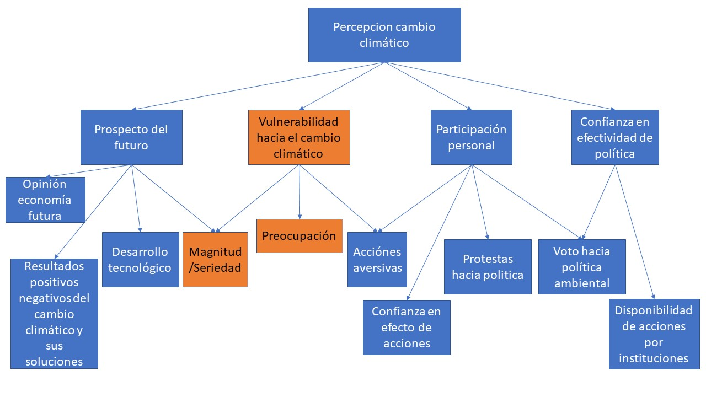

# 1 Limpiando el database

Primero, cargaremos los paquetes que utilizaremos en esta sesión:

```{r paquetes, warning=FALSE, message=FALSE}
library(tidyverse)
library(sjmisc)
library(haven)
library(kableExtra)
library(readxl)
library(skimr)
library(sjPlot)
library(naniar)
library(ggcorrplot)
```

Y cargaremos la base de datos con variables ya seleccionadas:

```{r}
df_2014 <- read_sav("data/Base_en_SAV_Primera_Encuesta_Nacional_de_Medio_Ambiente_2014.sav")
df_2015 <- read_sav("data/Base_en_SAV_Encuesta_Medio_Ambiente_2015.sav")
df_2016 <- read_sav("data/Base_en_SAV_Encuesta_de_Medio_Ambiente_2016.sav")
df_2018 <- read_excel("data/Base-en-excel-Encuesta-Nacional-de-Medio-Ambiente-2018.xlsx")
```

Es importante mencionar que algunas preguntas están doble. Como pregunta abierta, y luego fueron codificadas a base de respuestas similares.

```{r, results='hide'}
skimr::skim(df_2018)
```

```{r,results='hide'}
skimr::skim(df_2016)
sjPlot::view_df(df_2016)
```


```{r}
(sum(is.na(df_2016))/prod(dim(df_2016)))*100
```

```{r,results='hide'}
skimr::skim(df_2015)
```


```{r}
(sum(is.na(df_2015))/prod(dim(df_2015)))*100
```

```{r,results='hide'}
skimr::skim(df_2014)
```


```{r}
(sum(is.na(df_2014))/prod(dim(df_2014)))*100
```

Vemos que la cantidad de datos faltantes es poca para el 2016, un 2% de la base.2014 y 2015 ya tienen mas del 30% de datos faltantes. Si ocurre en solo unas de las columnas, se pueden remover de la base para tener una base de datos limpia. Para eso usamos la funcion sort:

```{r}
sort( colSums( sapply(df_2016, is.na) ), decreasing=TRUE) %>% head(20)
```
Vemos que son 14 columnas con datos faltantes para el 2016. De 2170 observaciones, falta más de el 25% (598/2170*100%= 27.2%) de los datos para los indicadores. Removemos todas las columnas que le falten mas de 15% de las observaciones. En vez de observar cuales columnas tiene mas de 15% en el 2015 y 2014, removemos las columnas directamente ya que no son útiles en todo caso.

```{r}
df_2016_final <- df_2016[, colMeans(is.na(df_2016)) <= .15]
df_2015_final <- df_2015[, colMeans(is.na(df_2015)) <= .15]
df_2014_final <- df_2014[, colMeans(is.na(df_2014)) <= .15]
```


El siguiente Excel ofrece una descripción de la base de datos de las encuestas.

Primero la data era la siguiente.

```{r, echo= FALSE}

readxl::read_excel("data/Overview data.xlsx") %>%
  knitr::kable(., align = 'lccccccc') %>%
    kable_styling(bootstrap_options = c("striped"), html_font = 'Roboto Condensed') %>%
      column_spec(1:2, width_min = "2cm", border_left = T) %>%
      column_spec(3:8, width_min = "3cm", border_left = T) %>%
 scroll_box(width = "100%", height = "400px")
```

vemos que habian columnas especificas con la mayoria de los datos faltantes. Las columnas que quedan, juntas, tienen menos del 0.19% con datos faltantes. Esta fracción del total se puede ignorar. Despues de limpiar el database, el *overview* cambia a la siguiente.

```{r}
(sum(is.na(df_2016_final))/prod(dim(df_2016_final)))*100
(sum(is.na(df_2015_final))/prod(dim(df_2015_final)))*100
(sum(is.na(df_2014_final))/prod(dim(df_2014_final)))*100
```

```{r, results='hide'}
skimr::skim(df_2014_final)
skimr::skim(df_2015_final)
skimr::skim(df_2016_final)
```


```{r, echo = FALSE}

readxl::read_excel("data/Overview data 2.xlsx") %>%
  knitr::kable(., align = 'lccccccc') %>%
    kable_styling(bootstrap_options = c("striped"), html_font = 'Roboto Condensed') %>%
      column_spec(1:2, width_min = "2cm", border_left = T) %>%
      column_spec(3:8, width_min = "3cm", border_left = T) %>%
 scroll_box(width = "100%", height = "400px")
```


# 2 EDA: Encontrando las variables operacionales

## 2.1 Encuesta nacional del 2018

Para simplificar el analisis, decido enfocarme solo en el 2016 y 2018 ya que es el mas completo de los años. A base del 2016 y 2018 decido cuales van a ser mis variables operacionales para todos los años.

```{r, results='hide'}

#re-ordering dataframe to have indicators in front

df_2018_final <- df_2018 %>%
  select("ZONAS", "ID", "COMUNA", "NSE","TNSE","NEDAD","TEDAD","REGION","CUOTA","POND", P32,P33,P34,P35,P36,P37,P38,P39, everything())
sjPlot::view_df(df_2018_final)
```

```{r, results='hide', echo=FALSE}
df_2018_final %>% head()

# Just some tests for myself

n_distinct(df_2018_final$P17_COD)
unique(df_2018_final$P17_COD)

n_distinct(df_2018_final$P26_OTRO)
# unique(df_2018_final$P26_OTRO)
```

## 2.2 Exploración de variables independientes

Primero que escoger mis variables independientes + de control voy a tener que entender su sesgo y varianca. Tengo mas que nada entender mis datos para asi tambien entender mis resultados.

Variables socio-económicos y socio-demograficas son:

* **Zonas (macrozona en Chile)**

* **NSE (nivel Soco-Economico)**
* **TNSE (xxxxx)**
* **NEDAD (categórica de edad; 18-34;31-45; 46-60; 61+)**
* **TEDAD (categórica de edad; 18-34; 35-54; 55+)**
* **P32: Sexo (categórica: Hombre (1); Mujer (0))**
* **P33: Edad (variable continua)**
* **P34: Nivel de educación (categórica del 1-10)**
* **P36: Estudia (categórica: Si(1);No (2))**
* **P37: Nivel de educación con mas aporte al ingreso del hogar (categórica: 1-10)**
* **P38: Profesión con mas aporte al ingreso del hogar (categórica: 1-10)**
* **P39: Religión (categórica: 1-9)**
* **P43: Tipo de combustible que usa el vehiculo del encuestado (categórica: 1-..)**
* **P8: Razón por la que alguien no usa bicicleta (categórica: 1-..)**
* **P18: Opinion de la causa del cambio climatico (categórca: 1-..)**

De estas solo considero las cursivas. Las cursivas voy a analizar para multicolineadid y asi reducir las variables independientes usadas mas.

```{r, results= 'hide', echo=FALSE}
# unique(df_2018_final$POND)
unique(df_2018_final$TNSE)
unique(df_2018_final$NSE)
n_distinct(df_2018_final$CUOTA)
```

```{r}
# Rename columns of independent variables
df_2018_final <-  df_2018_final %>% rename('Razon_Bici'= 'P8','Razon_Cambio_Cl'= 'P18','Automovil_Combustible'= 'P43', 'Sexo'='P32' ,'Edad'='P33' ,'Niv_Edu'='P34','Estudiante'='P36','Edu_Ingr'='P37','Trab_Ingr'= 'P38','Religion'='P39', 'Transporte_mas_freq' = 'P7')
```

```{r}
var_ind <- df_2018_final %>% 
  select(ZONAS, NSE, TNSE, NEDAD, TEDAD, Sexo, Edad, Niv_Edu, Estudiante, Edu_Ingr, Trab_Ingr, Religion, Razon_Bici,Razon_Cambio_Cl,Automovil_Combustible, Transporte_mas_freq
         ) %>% 
    group_by(ZONAS) %>% 
summarise_all(function(x)  mean(x, na.rm = T))
  # na.omit()
```
Vemos que hay un warning. Vamos a ver cual variable ocasiona estos warning y porque. Yo pienso que son Razon_Bici,Razon_Cambio_Cl,Automovil_Combustible. Las ultimas 3 variables tienen un ".", un dato que se puede considerar NA. Como no se puede reemplezar lo mejor es imputarlo con el valor que es equivalente a "No Responde" para estas preguntas, el número **9** para *Razon_Cambio_Cl(P18) y Automovil_Combustible (P43)*, el número **99** para *Razon_Bici (P8)*. Cambiamos las columnas a *numeric* y terminamos. Despues, volvemos a formar un subset de las variables independientes.

```{r, results='hide'}

unique(df_2018_final$ZONAS)
unique(df_2018_final$NSE)
unique(df_2018_final$TNSE)
unique(df_2018_final$NEDAD)
unique(df_2018_final$TEDAD)
unique(df_2018_final$Sexo)
unique(df_2018_final$Edad)
unique(df_2018_final$Niv_Edu)
unique(df_2018_final$Estudiante)
unique(df_2018_final$Razon_Bici)
unique(df_2018_final$Razon_Cambio_Cl)
unique(df_2018_final$Automovil_Combustible)
unique(df_2018_final$Transporte_mas_freq)

df_2018_final["Razon_Bici"][df_2018_final["Razon_Bici"] == "."] <- "9"
df_2018_final["Razon_Cambio_Cl"][df_2018_final["Razon_Cambio_Cl"] == "."] <- "99"
df_2018_final["Automovil_Combustible"][df_2018_final["Automovil_Combustible"] == "."] <- "99"

var_ind <- df_2018_final %>% 
  select(ZONAS, NSE, TNSE, NEDAD, TEDAD, Sexo, Edad, Niv_Edu, Estudiante, Edu_Ingr, Trab_Ingr, Religion, Razon_Bici,Razon_Cambio_Cl,Automovil_Combustible, Transporte_mas_freq
         ) %>% 
    group_by(ZONAS) 

#checking the class of every column
sapply(var_ind, class)

#applying a new class
var_ind[] <- lapply(var_ind, function(x) as.numeric(as.character(x)))
sjPlot::view_df(var_ind)
```
### 2.2.1 Multicolinealidad

El nivel de correlación para todas las variables es alta ya que las variables son mayormente categóricas. Por eso, solo removemos variables que presenten una correlación alta para la mayoria de variables y que tengan una relación explicativa conceptualmente lógica. Es decir, no consideramos el TNSE,porque el NSE ya captura el estatus socio-económico. TEDAD, NEDAD es reemplazado por la variable continua de edad para tener mejor ajuste y distribución para el input del modelo (la edad es algo que se puede medir).

```{r}
#only include numeric/nominal categoric values

colnames(var_ind)
corr_vdem <- var_ind %>% 
  select(7:16) %>% 
  cor(use = "pairwise") %>% 
  round(1)
ggcorrplot(corr_vdem, type = "lower", lab = T, tl.cex = 9, show.legend = F)

var_ind <- var_ind %>% 
  select(ZONAS, NSE, TNSE, NEDAD, TEDAD, Sexo, Edad, Niv_Edu, Estudiante, Trab_Ingr, Religion, Razon_Bici,Razon_Cambio_Cl,Automovil_Combustible, Transporte_mas_freq
         ) %>% 
    group_by(ZONAS)
```
Excluimos la variable Edu_Ingr (¿Cuál es el nivel de educación que alcanzó la persona que aporta el principal ingreso de este hogar?) por su nivel de correlación con Niv_Edu (¿Me podría decir cuál es tu nivel de educación?). Interesantemente, hay una correlación baja entre el Trab_Ing (¿Cuál es la profesión o trabajo de la persona que aporta el principal ingreso de este hogar?) y el Nivel de Educación.

Vemos que todas las otras variables tienen colinealidad baja por la que no se presenta multicolinealidad y se pueden usar todas. **Importante es saber que muchas de estas variables no son continuas, pero nominales.** Ahora vamos a ver las variables ordinales.

```{r}

#only include numeric values

colnames(var_ind)
corr_vdem <- var_ind %>% 
  select(1:6) %>% 
  cor(use = "pairwise") %>% 
  round(1)
ggcorrplot(corr_vdem, type = "lower", lab = T, tl.cex = 9, show.legend = F)

var_ind <- var_ind %>% 
  select(ZONAS, NSE, TEDAD, Sexo, Edad, Niv_Edu, Estudiante, Trab_Ingr, Religion, Razon_Bici,Razon_Cambio_Cl,Automovil_Combustible, Transporte_mas_freq
         ) %>% 
    group_by(ZONAS)
```

Vemos que la NEDAD y TEDAD estan altamente correlacionados. Es logico porque las dos son variables ordinales de la edad. Sin embargo, nos quedamos con TEDAD que divide la edad en cuatro categorias en vez de 3 como por NEDAD. Esto creo que mas varianza en el input del modelo. El TNSE lo excluimos por la misma razon.

Para reducir dimensionalidad y ocuparnos de tener las variables que son significante vamos a reducir la cantidad de variables independientes. 

Para variables categoricas en realidad no se puede medir la correlacion. Por eso usamos el Chi-squared test. Si el p<0.05 asumimos que las variables son en verdad independientes. Solo hago el analisis en los que supongo conceptualmente que tienen dependencia.

```{r}
chisq.test(var_ind$Estudiante, var_ind$Trab_Ingr,simulate.p.value = TRUE)


chisq.test(var_ind$Estudiante, var_ind$Razon_Bici,simulate.p.value = TRUE)


chisq.test(var_ind$Razon_Bici, var_ind$Razon_Cambio_Cl,simulate.p.value = TRUE)


chisq.test(var_ind$Razon_Bici, var_ind$Transporte_mas_freq, simulate.p.value = TRUE)


chisq.test(var_ind$Niv_Edu, var_ind$Estudiante,simulate.p.value = TRUE)

chisq.test(var_ind$Automovil_Combustible, var_ind$Niv_Edu,simulate.p.value = TRUE)


chisq.test(var_ind$Niv_Edu, var_ind$NSE,simulate.p.value = TRUE)

chisq.test(var_ind$Trab_Ingr, var_ind$NSE,simulate.p.value = TRUE)

chisq.test(var_ind$Transporte_mas_freq, var_ind$NSE, simulate.p.value = TRUE)

chisq.test(var_ind$ZONAS, var_ind$NSE,simulate.p.value = TRUE)

```

Todas parecen ser significantes, y por eso, independientes. Sin embargo, las aproximaciones pueden ser erroneas por los valores tan chicos. Esto resulta en un warning que me dio primero que usar el **simulated p-value**. Online decia esto:
"It gave the warning because many of the expected values will be very small and therefore the approximations of p may not be right."


Sin embargo, decido enfocarme en las variables mas cercanas a indicadores unicos de socio-economia. Estas serian, NSE, Edad, Sexo, Niv_Edu, Razon_Cambio_Cl. Las otras variables sirven como control.

```{r}
var_ind_s_control <- var_ind %>% select(NSE, Edad, Sexo, Niv_Edu, Razon_Cambio_Cl, ZONAS)
```

### 2.2.2 Visualización

```{r, echo=FALSE}
# iadm <- df$iedu018[df$year == 2012]
# hist(iadm, main = "", xlab = "log Igreso por impuestos", ylab = "Frecuencia")
# 
# logiadm <- log(iadm)
# hist(logiadm, main = "", xlab = "log Igreso por impuestos", ylab = "Frecuencia")
```

*Zonas:*

Vemos que hay mas respondientes en las zona 4 (el Sur), alrededor de un 30% mas. Es importante considerar esto, porque no solo nuestro modelo estara mas entrenado para la zona 4, sino que tambien la relacion nacional (el baseline del analisis) estara sesgado a respondientes de la zona 4. Otras zonas parecen tener una cantidad relativemente igual de encuestados.

```{r message=FALSE, warning=FALSE}
var_ind_s_control %>% 
  ggplot(aes(x = as_factor(ZONAS))) +
  geom_bar(color = "#ffafcc", fill = "#ffc8dd", alpha = 0.5) + # Colores
  labs(title = "Barplot de respondientes por zonas",
       x = " ", y = "Frecuencia") + # Títulos
  theme_minimal(base_family = "Roboto Condensed")
```

*Edad:*

Vemos que la edad esta razonablemente distruida de una forma normal para cada zona. Sin embargo, vemos que la zona 1 cuenta con una cantidad de encuestados altos bajo la edad de 25. En la zona 4, resalta que una cantidad alta de respondientes esta alrededor de los 50 anos. Las zonas 1 y 2 parecen tener relativamente mas jovenes que las zonas 3 y 4. Sin embargo, casi se puede ignorar esta diferencia.

A nivel nacional, la distribucion es muy similar a los de las zonas con un sesgo ligero a la izquierda, cual se puede deber a las zonas 1 y 2.

```{r}
var_ind_s_control %>% 
  ggplot(aes(x = Edad, na.rm = T)) +
  geom_histogram() +
  facet_grid(~ZONAS) +
  labs(x = "Edad por Zona", y = "Frecuencia",
       title = "Edad",       caption = "Fuente: Encuesta Nacional 2018")
```
```{r}
var_ind_s_control %>% 
  ggplot(aes(x = Edad, na.rm = T)) +
  geom_histogram() +
  labs(x = "Edad", y = "Frecuencia",
       title = "Edad distribución Nacional",       caption = "Fuente: Encuesta Nacional 2018")
```
*NSE:* 

Como se esperaba, el Nivel socioeconomico es mas alto en el Sur. Donde 1 (clase alta, ABC1) y 2 (clase media acomodada, C2) es lo mas alto. 3 a 5 va de clase media a clase mas pobre. El Norte (zona 1) parece tambien tener una cantidad alta de clase alta. La zona central y RM parecen tener una distribucion mas normal con individuos de todas las clases. En todos los clasos, la cantidad de pobres que se entrevisto es muy baja. *Esto anade un sesgo al Nivel Socio-económico* ya que nos falta datos de la percepción de esta clase de gente. Para la otra clase se puede hablar de una representación relativamente justa.

```{r message=FALSE, warning=FALSE}
var_ind_s_control %>% 
  ggplot(aes(x = as_factor(NSE))) +
  facet_grid(~ZONAS) +
  geom_bar(color = "#ffafcc", fill = "#ffc8dd", alpha = 0.5) + # Colores
  labs(title = "Barplot de NSE dividido en Zonas",
       x = " ", y = "Frecuencia") + # Títulos
  theme_minimal(base_family = "Roboto Condensed")
```
*Sexo:*

En general vemos que se entrevistaron menos hombres que mujeres. En todas las zonas se entrevistaron entre 25-40% mas mujeres que hombres.

```{r message=FALSE, warning=FALSE}
var_ind_s_control %>% 
  ggplot(aes(x = as_factor(Sexo))) +
  facet_grid(~ZONAS) +
  geom_bar(color = "#ffafcc", fill = "#ffc8dd", alpha = 0.5) + # Colores
  labs(title = "Distribución Sexo dividido por Zonas",
       x = " ", y = "Frecuencia") + # Títulos
  theme_minimal(base_family = "Roboto Condensed")
```

```{r message=FALSE, warning=FALSE}
var_ind_s_control %>% 
  ggplot(aes(x = as_factor(Sexo))) +
  geom_bar(color = "#ffafcc", fill = "#ffc8dd", alpha = 0.5) + # Colores
  labs(title = "Distribución Sexo distribución nacional",
       x = " ", y = "Frecuencia") + # Títulos
  theme_minimal(base_family = "Roboto Condensed")
```
*Nivel de educación:*

Vemos que en la mayoria de los casos el nivel de educación se divide en dos categorias: 
* 1) Universitaria completa (9)
* 2) Media completa (5)

Evidentemente, no hay una distribución normal de los datos. Esto es alarmante ya que indica que la variable puede anadir mucha inprecisión a los resultados del modelo. 

```{r message=FALSE, warning=FALSE}
var_ind_s_control %>% 
  ggplot(aes(x = as_factor(Niv_Edu))) +
  facet_grid(~ZONAS) +
  geom_bar(color = "#ffafcc", fill = "#ffc8dd", alpha = 0.5) + # Colores
  labs(title = "Barplot de Nivel de educación por zonas",
       x = " ", y = "Frecuencia") + # Títulos
  theme_minimal(base_family = "Roboto Condensed")
```
*Opinion de la razón del cambio climatico:*

Vemos que la mayoria de los encuestados, sin importar de donde vienen piensan mayormente que el cambio climatico viene por la actividad humana (1). Por esta razón, decidimos excluir esta variable de nuestro set de variables independientes. Una gran cantidad del grupo no respondió (99).

```{r message=FALSE, warning=FALSE}
var_ind_s_control %>% 
  ggplot(aes(x = as_factor(Razon_Cambio_Cl))) +
  facet_grid(~ZONAS) +
  geom_bar(color = "#ffafcc", fill = "#ffc8dd", alpha = 0.5) + # Colores
  labs(title = "Barplot de Razón del cambio climatico por zonas",
       x = " ", y = "Frecuencia") + # Títulos
  theme_minimal(base_family = "Roboto Condensed")
```
```{r}

var_ind_s_control <- var_ind_s_control %>% select(NSE, Edad, Sexo, Niv_Edu, ZONAS)
```


## 2.3 Variables dependientes

### 2.3.1 Las latentes

Las variables dependientes tienen el proposito de capturar la **percepción pública**. Como esto no es algo que se puede medir, se requiere el uso de variables latentes, cuales son subvariables las que se puede preguntar con mas precisión la opinion de alguien para una subcategoria. Es decir, la percepción pública la vamos a medir a traves de dos latentes, **seriedad de cambio climatico percibido** y **preocupación hacia el cambio climatico**. La manera de capturar la percepción pública sobre el cambio climatica es visible en la imagen abajo. Nos enfocamos en los cuadrantes naranjas (las dos latentes de interes). Estas dos latentes constituyen de diferentes preguntas en la Encuesta Nacional del 2018. 




### 2.3.2 Limpieza de datos

**Magnitud serian:**

* P1_MAmb Ordene los siguientes temas del más importante al menos importante para el país: Medioambiente

1	1er lugar
2	2do lugar
3	3er lugar
4	4to lugar
5	5to lugar

* P3A-F: ¿Cómo evalúa usted…? La calidad del aire (A), Flora y Fauna (B), Rios y lagos (C), el mar (D), plazas y parques urbanos (E), medio ambiente en general (F) en su región

1	Pésimo
2	Malo
3	Regular
4	Bueno
5	Excelente
8	No sabe
9	No responde

* P4 Comparando el estado del medio ambiente de su región hace 10 años atrás, ¿cómo calificaría usted el estado actual del medio ambiente en su región?

1	Mejor
2	Igual
3	Peor
8	No sabe
9	No responde


* P17_COD ¿Qué entiende usted por cambio climático? (codificado)

1	Aumento o disminución de la humedad
2	Aumento o disminución de los vientos
3	Cambios en la duración de las estaciones del año (ej. Veranos o inviernos más largos o más cortos)
4	Cambios en las lluvias (ej. Lluvias en fechas poco habituales, más/menos lluvias)
5	Cambios en las temperaturas (ej. Mucho más calor/frio)
6	Sequías más intensas y/o frecuentes
7	Otro
88	No sabe
99	No responde

* P20 ¿Cree usted que el cambio climático está sucediendo o sucederá en algún momento en el futuro?

1	Si, ya está ocurriendo
2	Ocurrirá en un futuro
3	Ya ocurrió
4	No ocurrirá
8	No sabe
9	No responde

P21A-D: Según su percepción, ¿cuán importante es el cambio climático para…?: Los chilenos (A), su región (B), familia y amigos (C), usted (D)

1	Nada importante
2	Poco importante
3	Bastante importante
4	Muy importante
8	No sabe
9	No responde

* P30 De acuerdo a lo que indican algunos científicos, en el planeta estamos viviendo la sexta extinción masiva de especies. ¿Sabe de especies animales o vegetales amenazadas o en peligro de extinción?

Sí, por ejemplo
Sí, pero no recuerdo el nombre
No sé de ninguna
No responde

**Preocupación serian:** 

* P2_COD Según su percepción, ¿cuál es el principal problema ambiental que lo afecta a Ud.? (codificado)

1	Basura
2	Cambio climático
3	Congestión vehicular
4	Contaminación acústica
5	Contaminación de Agua
6	Contaminación de Aire
7	Falta de árboles y de áreas verdes
8	Malos olores
9	Perros vagos y sus excrementos
10	Polen de los árboles que causan alergia
11	Sequía
12	Falta de agua
13	Ninguno
88	No sabe
99	No responde

* P19_1-8, 10: ¿Qué sentimientos o emociones le surgen cuando escucha sobre Cambio Climático? Pena/Tristeza/Dolor (1), Preocupación/Angustia (2), Miedo/Susto/Temor (3), Incertidumbre (4), Rabia/enfado (5), Frustración (6), Responsabilidad/culpa (7), Indiferencia (8), NO SABE (10)

0	No
1	Si


* P20 ¿Cree usted que el cambio climático está sucediendo o sucederá en algún momento en el futuro?

1	Si, ya está ocurriendo
2	Ocurrirá en un futuro
3	Ya ocurrió
4	No ocurrirá
8	No sabe
9	No responde

* P30 De acuerdo a lo que indican algunos científicos, en el planeta estamos viviendo la sexta extinción masiva de especies. ¿Sabe de especies animales o vegetales amenazadas o en peligro de extinción?

1 Sí, por ejemplo
2 Sí, pero no recuerdo el nombre
3 No sé de ninguna
9 No responde


```{r}
#create subset of dependent variables
var_dep <- df_2018_final %>%
          select(P1_MAmb,P2_COD,P3A,P3B,P3C,P3D,P3E,P3F,P4,
                 P17_COD,P19_1,P19_2,P19_3,P19_4,P19_5,P19_6,
                 P19_7,P19_8, P19_10, P20,P21A,P21B,P21C,
                 P21D,P30)
```


```{r}
#1 to 7

#no NA values

unique(var_dep$P1_MAmb)
unique(var_dep$P2_COD)
unique(var_dep$P3A)
unique(var_dep$P3B)

unique(var_dep$P3C)
unique(var_dep$P3D)
unique(var_dep$P3E)
unique(var_dep$P3F)
unique(var_dep$P4)
```


```{r}
#17 to 19

#no NA
unique(var_dep$P17_COD)

#has NA
unique(var_dep$P19_1)
unique(var_dep$P19_2)
unique(var_dep$P19_3)
unique(var_dep$P19_4)
unique(var_dep$P19_5)
unique(var_dep$P19_6)
unique(var_dep$P19_7)
unique(var_dep$P19_8)
unique(var_dep$P19_10)


#cleaning NAs by putting the "." as NA
var_dep %>% replace_with_na(replace = list(P19_1 = ".", P19_2= ".",P19_3=".",P19_4=".",P19_5=".",
                                           P19_6=".",P19_7=".",P19_8=".",P19_10="."))


```

```{r}
#no NA
unique(var_dep$P20)

#has NA
unique(var_dep$P21A)
unique(var_dep$P21B)
unique(var_dep$P21C)
unique(var_dep$P21D)

#cleaning NAs by putting the "." as NA
var_dep %>% replace_with_na(replace = list(P21A = ".", P21B= ".",P21C=".",P21D="."))

#no NA
unique(var_dep$P30)
```

### 2.3.2 Creación del score de percepción

#### 2.3.2.1 Entendiendo las escalas


Ahora que he limpiado todos los datos, en orden para obtener la preocupación pública decido sumar las respuestas de los encuestados. Para que esto sea posible, voy a sumar las respuestas a lo que llamo el **perception score**. Mientras mas alto sea este perception score, mas alto sera la preocupación y seriedad percibida. Para realizar esto hay que normalizar todos los valores de todas las preguntas en la siguiente forma:

* 0 - No responde, No disponible
* 1 - No importante
* 2 - No tan importante
* 3 - Neutral
* 4 - Importante
* 5 - Muy importante


**Es importante entender que todas las preguntas tienen otro formato y no todos indican relevancia hacia el medio ambiente directa. Esto es claramente una limitación. Sin embargo, asumimos que es la asumción es valida ya que indirectamente un número mas bajo en las preguntas codificadas se relaciona con acciones, y percepciones menos enfocadas hacia el medio ambiente.** Donde este no sea el caso, me ocupo manualmente de cambiar el formato en algo que concuerde con el formato para el perception score mencionado arriba. Ya esto forma la primera base útil para el modelo. 


* P1_Mambm: 1 a 5 -> 5 (=1) a 1 (=5)
* P3;A-F: 1 a 5 -> 5 (=1) a 1 (=5), 8 (=0), 9 (=0)
* P4: 1 a 3 -> 1 (=1), 2 (=3), 3 (=5), 8 (=0), 9 (=0)
* P19;1-7: 0 a 1 -> 0 (=1), 1 (=5)
* P19;8: 0 a 1 -> 0 (=5), 1 (=1)
* P20: 1 a 4 -> 4 (=1), 3 (=5), 2 (=3), 1 (=4), 8 (=0), 9 (=0)
* P21;A-D: 1 a 5 -> 1 (=1) a 5 (=5), 8 (=0), 9 (=0)
* P30: 1 a 3 -> 1 (=5), 2 (=3), 3 (=1), 9 (=0)

Excepciones:
* P2_COD tiene que ser una variable dependiente separada, porque calcula la percepción del cambio climatico en terminos no-cuantitativos. Ve la diferencia en percepcion, y no la preocupación o relevancia.
* P17_COD tiene que ser una variable dependiente separada, porque calcula la percepción del cambio climatico en terminos no-cuantitativos. Ve la diferencia en percepcion, y no la preocupación o relevancia.

Como trataremos a estas excepciones se vera luego.


```{r}
#Normalizing input values


```

```{r echo=FALSE}
#summing up all the columns to make the variable perception score
# var_dep %>%
#   score_perc = rowSums(select(everything()))
 
# var_dep$percepcion_score <- rowSums(var_dep[,c(1,2,3,4,5,6,7,8,9,30)],na.rm=TRUE)

# var_dep %>%
#   mutate(score_perc = rowSums(var_dep[,1:28]), 
#         na.rm = TRUE)
```


# 3 Construcción de modelo


https://www.scribbr.com/statistics/anova-in-r/ 

```{r, results='hide', echo=FALSE}
#To control on Zonas USE LATER

# predict_model_1a <- prediction::prediction(
#   mod1a, at = list(W = unique(model.frame(mod1a)$W))
# )
# 
# summary(predict_model_1a)
# 
# cdat <- cplot(mod1a, "W", what = "prediction",
#               main = "Pr(Tamaño de la coalición ganadora)", draw = F)
# 
# ggplot(cdat, aes(x = xvals)) +
#   geom_line(aes(y = yvals)) +
#   geom_line(aes(y = upper), linetype = 2)+
#   geom_line(aes(y = lower), linetype = 2) +
#   geom_hline(yintercept = 0) +
#   labs(title = "Pr. las visitas diplomáticas de EEUU",
#        x = "Tamaño de la coalición ganadora", y = "Prob. predicha") +
#   hrbrthemes::theme_ipsum_rc()
```
```{r, results='hide', echo=FALSE}
#Para ver Average Marginal Effect (sort of sensitivity analysis)

# ¿Cuál es el efecto medio?

# marginal_ef <- margins(mod1a)
# 
# plot(marginal_ef)

```


## 3.1 Modelo regresión múltiple

Nuestra variable dependiente es continua ya que se toma el promedio.

Requisitos para regresión múltiple:

* Tamano muestral elevado de minimo 500 observaciones. Tenemos 7601 observaciones asi que satisfacemos eso.
* Variable dependiente tiene que ser continua o dicotómica
* Mejor es ver relacion individual entre VD y VI y despues anadir al set de componentes
* No anadir variables innecesarias!
* Para tener variables significativas , el p < 0.05

Pasos en esta parte ya que escogimos nuestras variables y cumplimos requerimientos tecnicos:

* 3. Estimacion y ajuste del modelo
* 4. Interpretar los resultados

		a. Para interpretar el coeficiente hay que convertir los resultados a odds. Mientras mas lejos de 1, no importa la dirección, mayor sera el impacto de la variable!
		
		b. Ver si hay alguna endogeonidad
		
* 5. Validar los resultados

### 3.1.1 Resultados preliminares

El AIC mide la “distancia” que existe entre los parámetros verdaderos y los estimadores del modelo mediante una distancia matemática llamada divergencia Kullback-Leibler. Cuanto más pequeña sea la distancia, mejor será el modelo.

El BIC, a diferencia del AIC, penaliza la complejidad del modelo más rigurosamente ya que además toma en consideración el número de observaciones de la muestra.

Grafico ROC: Lo más importante de la figura es el área debajo de la curva diagonal que la cruza.
Sensibilidad: relación entre los verdaderos positivos y la suma de los verdaderos positivos más los falsos negativos.
Especificidad: relación entre los verdaderos negativos y la suma de los falsos positivos a los verdaderos negativos.
Tener en consideración el cálculo del AUC (Área bajo la Curva): cuanto mayor sea, mejor será el ajuste.

```{r}
# ¿Cuál es el efecto medio?
# 
# marginal_ef <- margins(mod1a)
# plot(marginal_ef)
# 
# library(pscl)
# 
# # Pseudo R-cuadrado
# 
# pR2(mod1b)[["McFadden"]]
# 
# # Pseudo R cuadrado ajustado
# 
# library(DescTools)
# 
# PseudoR2(mod1b, c("McFadden"))
# 

```


```{r, echo=FALSE}
# ROC

# library(plotROC)
# 
# pred_models <- bind_rows(augment(mod1b, response.type = "pred") %>%
#                            mutate(model = "Modelo 1"),
#                          augment(mod2, response.type = "pred") %>%
#                            mutate(model = "Modelo 2"),
#                          augment(mod3, response.type = "pred") %>%
#                            mutate(model = "Modelo 3"))
# 
# roc <- ggplot(pred_models, aes(d = election, m = .fitted, color = model)) +
#   geom_roc(n.cuts = 0) + 
#   geom_abline(slope = 1) +
#   labs(x = "1 - especificidad", y = "Sensibilidad") +
#   hrbrthemes::theme_ipsum_rc()
# 
# roc
# 
# calc_auc(roc)

```

## 3.2 Regresión logistica ordinal

Ya que nuestra variable fue formada a base de una escala, se puede tomar su promedio y redondear hacia un valor redondadeo (ej., 1). Esto hace que la variable dependiente sea ordinal. Cuales efectos tendra esto?

Para poder analizar esto cargamos el package multinom.

```{r}
library(MASS)
```


